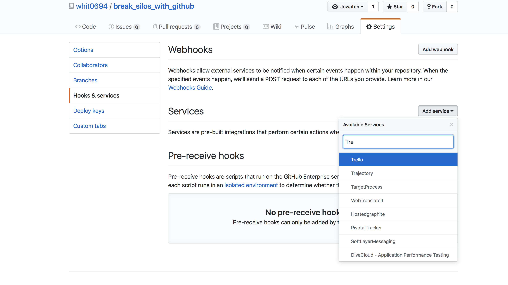

footer: Ian Whitney -- `whit0694` (email) --  `ian_whitney` (slack)
theme: Ostrich, 4

[.footer: Wikimedia]

^Goal of TechPeople is to build bridges between Silos
^Amanda Costello’s talk
^As part of our mission, we'd like to talk about specific ways to remove these silos

---

# [fit] Destroying
# [fit] Silos With
# [fit] GitHub

[.hide-footer]

^Goal of TechPeople is to build bridges between Silos
^Amanda Costello’s talk
^As part of our mission, we'd like to talk about specific ways to remove these silos
^And today I'm going to show you how you can use GitHub to destroy silos

---

# [fit] Wait,
# [fit] GitHub?

---

[.footer: Flickr: thevoicewithin]

^I thought that was for Coders
^Jenn has been introducing it to Communications, Designers, BAs, Data Analysts
^A wide variety of users! Some don't even have stickers on their laptops

---

[.footer: Wikimedia]

^Or, maybe you think it's just a place to store stuff
^If it was only that I’d be telling you to use Google Drive
^But it’s a tool for collaboration

---

# [fit] GitHub
# [fit] is Collaboration

---
[.footer: WOCinTech Chat]

> Collaboration Destroys Silos
> GitHub is Collaboration
> Therefore GitHub Destroys Silos
-- Aristotle

---

# [fit] OK
# [fit] Let's destroy silos!

^ Something to move us to types of silos and relevant GitHub tools

---

[.footer: WOCinTech Chat]

![right] (images/yourself.jpg)

# [fit] Silo One
# [fit] **Yourself**

^ The idea of you as a silo may be surprising.
^ But if you've ever had to look back at work you wrote a year ago, you know how unfamiliar your own work can be.

---

# [fit] Silo One: **Yourself**

- I have no idea what I changed a year ago
- I do not know why I made that change

^ When I go back to something I worked on that's now broken, these are the two questions I have. What Change and Why.

---

# [fit] Destroying Silo One

- Use **Comparsions** to see what changed
- Use **Commits** to see why

---

# [fit] **Comparsions**
# [fit] to see what
# [fit] changed

### I have no idea what I changed a year ago

---

^ This is an example of a comparison to see what changed.
^ On the left is the old version of the file, the new version is on the right
^ Red lines are deleted, green lines added
^ So we can easily see here that 2 lines were replaced with 8 new lines
^ You can do this for a single file, or for a bunch all at once.

---

[.hide-footer]

^ You can also Compare versions of images.

---

# [fit] **Commits**
# [fit] to see why

### I do not know why I made that change

---

^ When you change a file you include a message, called the Commit Message.
^ Think hard about what you put in your Commit Message. This is a message to future you where you can explain why you made this change

---

^ You can leave your self a cryptic message devoid of any context, like I did here.
^ Why was it silly? Will bad things happen if I change it back?

---

[.hide-footer]

^ Or you can explain what you were thinking
^ And what future you should keep in mind before changing things again

---

[.footer: WOCinTech Chat]

![right fit] (images/your_team.jpg)

# [fit] Silo Two
# [fit] **Your Team**

^ You all work on the same team, but you’re still individuals. Silos can form.
^ Maybe you do most of the work on a project, and now a co-worker needs to help out
^ Or you end up fixing something while your co-worker is out on vacation

---
# [fit] Silo Two: **Your Team**

- My team does not know what this project does
- I do not know about changes they make

^ They can use the tools we already saw -- comparing and looking at commits
^ But GitHub offers tools that are great for teams!

---

# [fit] Destroying Silo Two

- Use **Readme** to introduce your projects
- Use **Pull Requests** to manage changes

---

# [fit] **Readme**
# [fit] to introduce
# [fit] your projects

### My team does not know what this project does

---

[.hide-footer]

^ Readmes
	^ GitHub puts a text file, named Readme, front and center.
	^ A place to introduce what a project does and how to use it

---

# [fit] **Pull Requests**
# [fit] to manage
# [fit] changes

### I do not know about changes they make

---

[.hide-footer]

^ Situations we've probably all been in.
  ^ Unbeknownst to you, a team-mate makes a change and heads off on vacation. When that first frantic support call comes in, you have no idea what's going on.
  ^ Or, you make a change only to find out that you ended up breaking a team-mate's project. 
  ^ If only you had a way of publicizing these changes!
  ^ With Pull Requests, GitHub gives you a tool to publicize and discuss changes.
  ^ In this PR my teammate Shawn was creating a new library and my co-worker Davin offered some suggestions to improve it. Now both Shawn and Davin know what this code does. And neither will be caught off guard by the change.

---

[.footer: WOCinTech Chat]

![right fit] (images/your_department.jpg)

# [fit] Silo Three
# [fit] **Your Department**

^ Your team is communicating well, now it’s time to break down the silo that separates you from the rest of your department
^ You want a web page to tell everyone about one of your projects, or your team
^ You want to collaborate with a BA in a different part of your department
^ You want to show the director how much progress you're making

---

# [fit] Silo Three: **Your Department**

- My department doesn't know what my team does
- My team needs to work with people across my department
- My manager wants to see progress in Jira/Trello/Etc

--- 

# [fit] Destroying Silo Three

- Use **Pages** to show off your team
- Use **Teams** to collaborate with others
- Use **Integrations** to work with other tools

---

# [fit] **Pages**
# [fit] to show off
# [fit] your team

### My department doesn't know what my team does
---
[.hide-footer]

^ GitHub Pages lets you create simple, static websites of any size.
  ^ And you manage them within GitHub, so you have access to all of GitHub's tools
    ^ Commits, comparing changes, pull requests, the works
^ When you make a change, your site is updated within minutes
  ^ Use github.umn.edu to create a page that's only visible to people on campus
  ^ Or use github.com to create a page that's visible world wide.

---

# [fit] **Teams**
# [fit] to collaborate
# [fit] with others

### My team needs to work with people across my department

---
[.hide-footer]

^ A lot of projects need a wide range of experts.
^ You might manage the code, but need to collaborate with a BA from a different part of your department.
^ A GitHub Team lets you share access to your work

---

# [fit] **Integrations**
# [fit] to work with
# [fit] other tools

### My manager wants to see progress in Jira/Trello/Etc

---
[.hide-footer]

^ You can connect GitHub to an amazing number of other tools
^ Trello, Jira, Slack, Pivotal, so many more
^ Exact setup will vary by what you're trying to connect to

---

![right fit] (images/your_university.png)

# [fit] Silo Four
# [fit] **Your University**

^Your department is humming.
^Now let's break down the walls between your department and the rest of the University
^All the same tools still apply.
  ^Readmes and Pages to publicize your work
  ^Teams to collaborate with others
^But there are more!

---

# [fit] Silo Four: **Your University**

- What does that department do?
- What's up with that project?
- What does that person do?
- Does my friend know about this?

---

# [fit] Destroying Silo Four

- Use **Organizations** to see what a department does
- Use **Watch** to see when a project changes
- Use **Follow** to see what a person does
- Use **@** to notify others

---

# [fit] **Organizations**
# [fit] to see what
# [fit] a department does

### What does that department do?

---
[.hide-footer]

^There's a department or team you collaborate with, or that you want to collaborate with
^ Check out their "Organization" page to see their projects and recent changes

---

# [fit] **Watch**
# [fit] to see when
# [fit] a project changes

### What's up with that project?

---
[.hide-footer]

^There's a project that you use, and you want to know when it changes
^If you choose "Watch" then you'll be emailed about Pull Requests and other discussions.

---

# [fit] **Follow**
# [fit] to see what
# [fit] a person does

### What does that person do?

---
[.hide-footer]

^There's a person you collaborate with, or that you want to collaborate with
^ Check out their page to see their projects and recent changes
^ Click "Follow" to "receive notifications about their activity"

---

# [fit] **@**
# [fit] to notify
# [fit] others

### Does my friend know about this?

---

[.hide-footer]

^I had a question about a feature Elleni requested
^When I include her internet id, prefixed with the `@` sign, she's notified

--- 

# [fit] This Is
# [fit] **Great**

---

## [fit] Now What?

- How can I read more?
- How can I talk to others?

---

# [fit] How can I
# [fit] read more?

# [fit] **https://help.github.com**

---

# [fit] How can I
# [fit] talk to others
# [fit] online?

### [fit] **https://z.umn.edu/tpslack**
### [fit] **#github** or **#hacker-hours**

---

# [fit] How can I
# [fit] talk to others
# [fit] in person?

### [fit] **http://umnhackerhours.github.io**

---

[.hide-footer]

# [fit] Thank 
# [fit] You!

## **Ian Whitney**
### `whit0694` (email)
### `ian_whitney` (slack)
### `Surdyk's in Northrop` (coffee)
