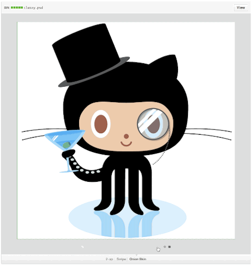
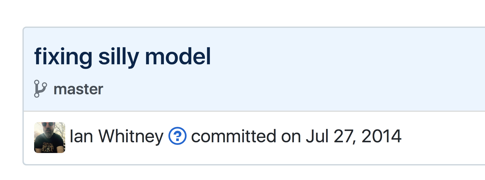
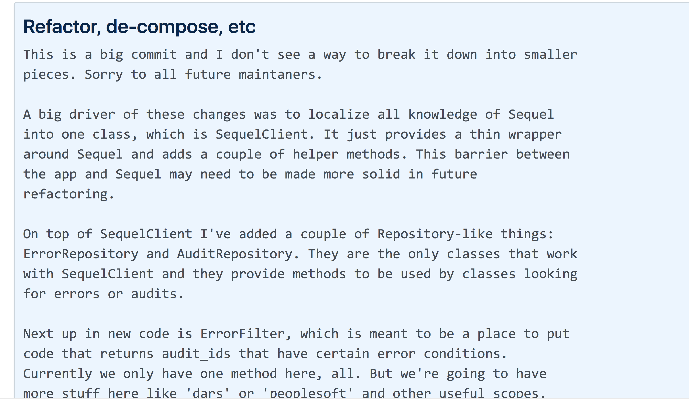
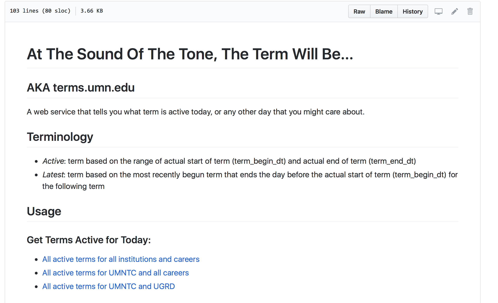
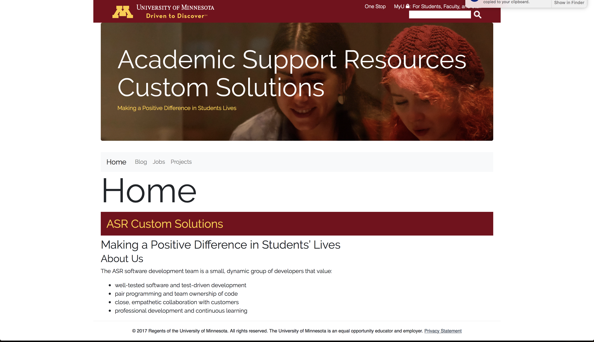
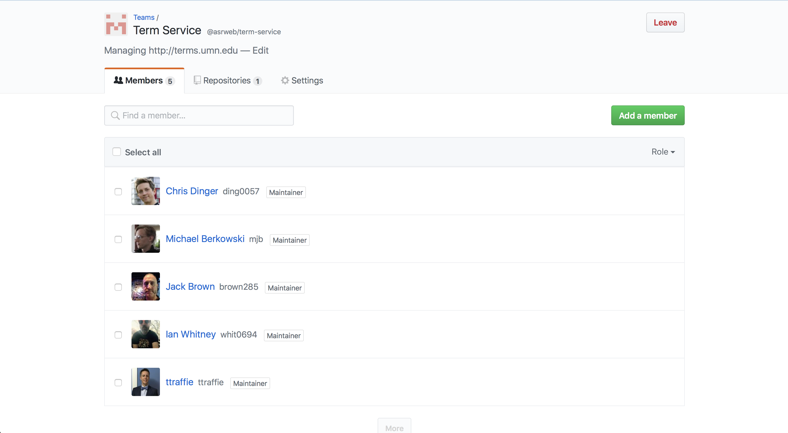
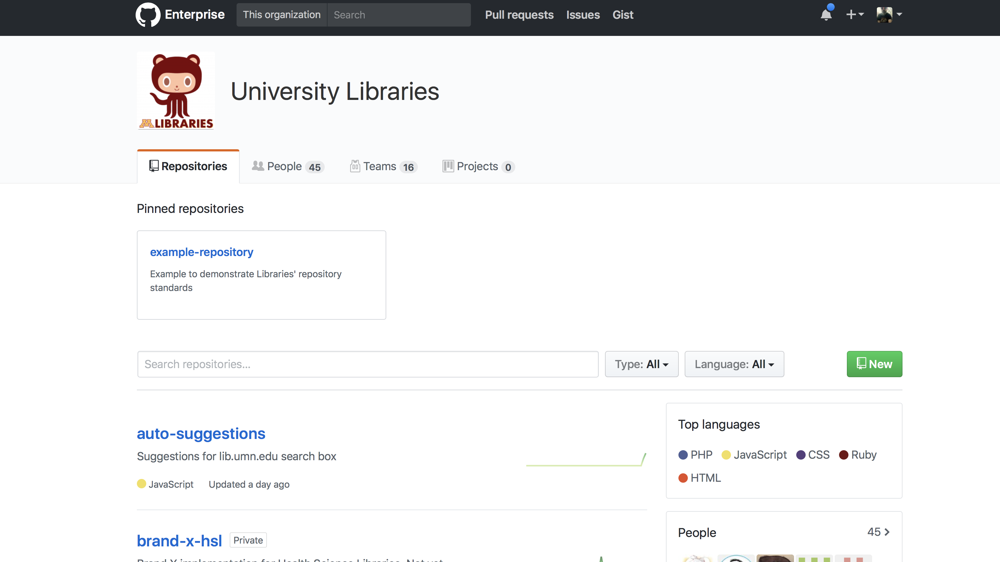
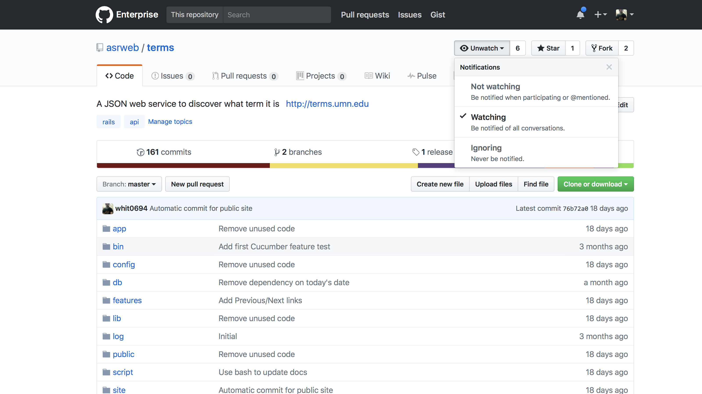
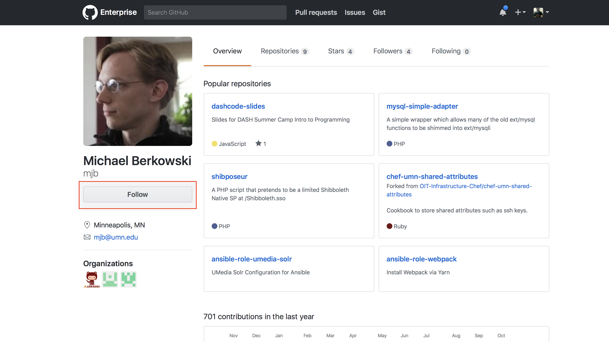

footer: Ian Whitney -- `whit0694` (email) --  `ian_whitney` (slack)

[.hide-footer]

^Goal of TechPeople is to build bridges between Silos
^Amanda Costello’s talk
^As part of our mission, we'd like to talk about specific ways to remove these silos
^And today I'm going to show you how you can use GitHub to destroy silos

---

> Wait, GitHub?

---

[.hide-footer]

^I thought that was for Coders
^Jenn has been introducing it to Communications, Designers, BAs, Data Analysts
^A wide variety of users! Some don't even have stickers on their laptops

---

[.hide-footer]

^Or, maybe you think it's just a place to store stuff
^If it was only that I’d be telling you to use Google Drive
^But it’s a tool for collaboration

---
[.footer: WOCinTech Chat]

> Collaboration Destroys Silos
> GitHub is Collaboration
> Therefore GitHub Destroys Silos
-- Aristotle

---

# TBD: Transition

^ Something to move us to types of silos and relevant GitHub tools

---

[.footer: WOCinTech Chat]

![right] (images/yourself.jpg)

# Silo One: Yourself

^ The idea of you as a silo may be surprising.
^ But if you've ever had to look back at work you wrote a year ago, you know how unfamiliar your own work can be.

---

# Silo One: Yourself

- What changed?!
- Why?!

^ When I go back to something I worked on that's now broken, these are the two questions I have. What Change and Why.

---

# Destroying Silo One

- Use **Comparsions** to see what changed
- Use **Commits** to see why

---

# Use **Comparsions** to see what changed

---

^ This is an example of a comparison to see what changed.
^ On the left is the old version of the file, the new version is on the right
^ Red lines are deleted, green lines added
^ So we can easily see here that 2 lines were replaced with 8 new lines
^ You can do this for a single file, or for a bunch all at once.

---

[.hide-footer]

^ You can also Compare versions of images.

---

# Use **Commits** to see what changed

---

^ When you change a file you include a message, called the Commit Message.
^ Think hard about what you put in your Commit Message. This is a message to future you where you can explain why you made this change

---

^ You can leave your self a cryptic message devoid of any context, like I did here.
^ Why was it silly? Will bad things happen if I change it back?

---

[.hide-footer]

^ Or you can explain what you were thinking
^ And what future you should keep in mind before changing things again

---

[.footer: WOCinTech Chat]

![right fit] (images/your_team.jpg)

# Silo Two: Your Team

^ You all work on the same team, but you’re still individuals. Silos can form.
^ Maybe you do most of the work on a project, and now a co-worker needs to help out
^ Or you end up fixing something while your co-worker is out on vacation

---
# Silo Two: Your Team

- How can you introduce projects to your team?
- How can the team be aware of changes that are being made?

^ They can use the tools we already saw -- comparing and looking at commits
^ But GitHub offers tools that are great for teams!

---

# Destroying Silo Two

- Use **Readme** to introduce your projects
- Use **Pull Requests** to manage changes

---

# Use **Readme** to introduce your projects

---

[.hide-footer]

^ Readmes
	^ GitHub puts a text file, named Readme, front and center.
	^ A place to introduce what a project does and how to use it

---

# Use **Pull Requests** to manage changes

---

[.hide-footer]

^ Situations we've probably all been in.
  ^ Unbeknownst to you, a team-mate makes a change and heads off on vacation. When that first frantic support call comes in, you have no idea what's going on.
  ^ Or, you make a change only to find out that you ended up breaking a team-mate's project. 
  ^ If only you had a way of publicizing these changes!
  ^ With Pull Requests, GitHub gives you a tool to publicize and discuss changes.
  ^ In this PR my teammate Shawn was creating a new library and my co-worker Davin offered some suggestions to improve it. Now both Shawn and Davin know what this code does. And neither will be caught off guard by the change.

---

[.footer: WOCinTech Chat]

![right fit] (images/your_department.jpg)

# Silo Three: Your Department

^ Your team is communicating well, now it’s time to break down the silo that separates you from the rest of your department
^ You want a web page to tell everyone about one of your projects, or your team
^ You want to collaborate with a BA in a different part of your department
^ You want to show the director how much progress you're making

---

# Silo Three: Your Department

- No one else in your department knows what you do
- Your project needs help from people in 3 other teams
- Your manager wants to see progress in Jira/Trello/Etc

--- 

# Destroying Silo Three

- Use **Pages** to show off your team or projects
- Use **Teams** to collaborate with other people
- Use **Integrations** to work with other tools

---

# Use **Pages** to show off your team or projects

---

^ GitHub Pages lets you create simple, static websites of any size.
  ^ And you manage them within GitHub, so you have access to all of GitHub's tools
    ^ Commits, comparing changes, pull requests, the works
^ When you make a change, your site is updated within minutes
  ^ Use github.umn.edu to create a page that's only visible to people on campus
  ^ Or use github.com to create a page that's visible world wide.

---

# Use **Teams** to collaborate with other people

---

^ A lot of projects need a wide range of experts.
^ You might manage the code, but need to collaborate with a BA from a different part of your department.
^ A GitHub Team lets you share access to your work

---

# Use **Integrations** to work with other tools

---

# Integrations

- Trello
- Jira
- Slack
- Pivotal
- Etc.

^ GitHub integrates with a huge number of other tools, probably including the one your manager wants to use.
^ And it integrates with a bunch of other tools, like Travis CI, which we'll be talking about at an upcoming Code People meeting.

---

![right fit] (images/your_university.png)

# Silo Four: Your University

^Your department is humming.
^Now let's break down the walls between your department and the rest of the University
^All the same tools still apply.
  ^Readmes, Wikis and Pages to publicize your work
  ^Teams to collaborate with others
^But there are more!

---

# Silo Four: Your University

- You want to know what another department is working on
- You want to know when a project changes
- You want to know what another person is working on
- You want to tell another person about a change

---

# Destroying Silo Four

- Use **Organizations** to see what a department is working on
- Use **Watch** to see when a project changes
- Use **Follow** to see what a developer is working on
- Use **@** to notify others

---

# Use **Organizations** to see what a department is working on

---

^There's a department or team you collaborate with, or that you want to collaborate with
^ Check out their "Organization" page to see their projects and recent changes

---

# Use **Watch** to see when a project changes

---

^There's a project that you use, and you want to know when it changes
^If you choose "Watch" then you'll be emailed about Pull Requests and other discussions.

---

# Use **Follow** to see what a developer is working on

---

^There's a developer or you collaborate with, or that you want to collaborate with
^ Check out their page to see their projects and recent changes
^ Click "Follow" to "receive notifications about their activity"

---

# Use **@** to notify others

---

[.hide-footer]

^I had a question about a feature Elleni requested
^When I include her internet id, prefixed with the `@` sign, she's notified

--- 

# This Is Great
## Now What?

- How can I read more?
- How can I talk to others?

---

# How can I read more?

### https://help.github.com

---

# How can I talk to others?
## Online

### https://z.umn.edu/tpslack
### \#github or #hacker-hours

---

# How can I talk to others?
## In Person

### http://umnhackerhours.github.io

---

# Thank You!

## Ian Whitney
### `whit0694` (email)
### `ian_whitney` (Slack)
### `Surdyk's in Northrop` (coffee)
