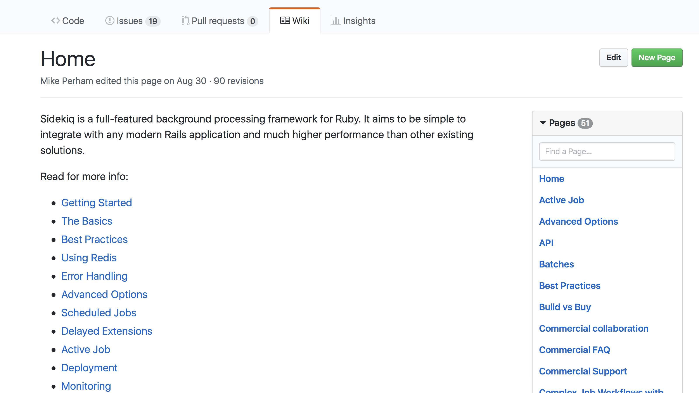

footer: Ian Whitney -- `whit0694` (email) --  `ian_whitney` (slack)

[.hide-footer]

^Goal of TechPeople is to build bridges between Silos
^Amanda Costello’s talk
^As part of our mission, we'd like to talk about specific ways to remove these silos
^And today I'm going to show you how you can use GitHub to destroy silos

---

> Wait, GitHub?

---

[.hide-footer]

^I thought that was for Coders
^Jenn has been introducing it to Communications, Designers, BAs, Data Analysts
^A wide variety of users! Some don't even have stickers on their laptops

---

[.hide-footer]

^Or, maybe you think it's just a place to store stuff
^If it was only that I’d be telling you to use Google Drive
^But it’s a tool for collaboration

---
[.footer: WOCinTech Chat]

> Collaboration Destroys Silos
> GitHub is Collaboration
> Therefore GitHub Destroys Silos
-- Aristotle

---

# TBD: Transition

^ Something to move us to types of silos and relevant GitHub tools

---

[.footer: WOCinTech Chat]

![right] (images/yourself.jpg)

# Silo One: Yourself

^ The idea of you as a silo may be surprising.
^ But if you've ever had to look back at work you wrote a year ago, you know how unfamiliar your own work can be

---

[.hide-footer]

^ You last week/month/year is not the you of today
^ What work were you doing? Why were you doing it?

---

> Using GitHub to answer, "What Changed?"

^ Let's start with the first question. 
^ Your project used to work, now it doesn't. What changed?

---

^ This movie demonstrates text diffing

---

[.hide-footer]

^ This movie demonstrates image diffing

---

^ This movie demonstrates diffs between releases

---

> Using GitHub to answer, "Why?"

^ What Changed is a useful question to answer
^ But if you change it back will you break something else?
^ Why is far more powerful.

---

# [fit] Dear Future Self...

^ GitHub lets you send a message to your future self.
^ You can use this to warn yourself of dangers long forgotten
^ The value of this message is up to you.

---

^ You can leave your self a cryptic message devoid of any context

---

[.hide-footer]

^ Or you can explain what you were thinking
^ And what future you should keep in mind before changing things again

---

[.footer: WOCinTech Chat]

![right fit] (images/your_team.jpg)

# Silo Two: Your Team

^ You all work on the same team, but you’re still individuals. Silos can form.
^ Maybe you do most of the work on a project, and now a co-worker needs to help out
^ Or you end up fixing something while your co-worker is out on vacation

---

- How can you introduce projects your team?
- How can they make changes if you're not around?
- How can the team be aware of changes that are being made?

^ They can use the tools we already saw -- comparing and looking at commits
^ But GitHub offers tools that are great for teams!

---

[.footer: https://z.umn.edu/tp\_iw\_readme]

> Your README is your code’s most important work of documentation.
-- Steve Richert

^ Readmes
	^ GitHub puts a text file, named Readme, front and center.
	^ Simple setup directions, explanations of what this thing does.
	^ Go deeper. Philosophy, history, intent

---

[.hide-footer]

^ Wikis
	^ If a single readme is not enough, you can host a whole Wiki

---

[.hide-footer]

^ Pull Requests & Reviews
	^ When someone wants to change something, you can give the team a chance to review and comment
  ^ In this PR my teammate Shawn was creating a new library and my co-worker Davin offered some suggestions. Now both Shawn and Davin know what this code does.

---

[.footer: WOCinTech Chat]

![right fit] (images/your_department.jpg)

# Silo Three: Your Department

^ Your team is communicating well, now it’s time to break down the silo that separates you from the rest of your department
^ You want a web page to tell everyone about one of your projects, or your team
^ You want to collaborate with a BA in a different part of your department
^ You want to show the director how much progress you're making

--- 

- Use **Pages** to show off your team or projects
- Use **Teams** to collaborate with others
- Use **Projects** to show managers your progress

---

^ With GitHub Pages you can create simple websites of any size.
  ^ And you manage them within GitHub, so you have access to all of GitHub's tools
    ^ Commits, comparing changes, pull requests, the works
^ When you make a change, your site is updated within minutes
  ^ Use github.umn.edu to create a page that's only visible to people on campus
  ^ Or use github.com to create a page that's visible world wide.

---

^ A lot of projects need a wide range of experts.
^ You might manage the code, but need to collaborate with a BA from a different part of your department.
^ A Team in GitHub allows you to collaborate with anyone

---

^ Integration with Jira/Pivotal/Trello/etc
^ Not sure if this slide is worth it.

---

## Your University
- Releasing your work to the world
	- Releases
	- Announce the changes
	- Give others a chance to use your work
- Watches_Stars_Following Users
	- Connect with other people at the U that do work you like
	- Hear about their new stuff
	- Or they can hear about what you’re up to!
- Learn more
	- lunch
	- github docs

--- 

# This Is Great
## Now What?

^ A slide for action items.
^ How do I get started with GitHub?
^ How do I learn more?
